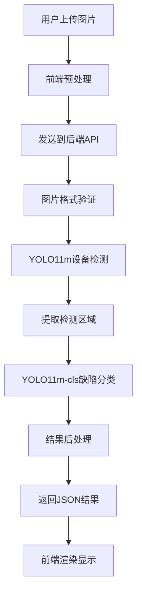
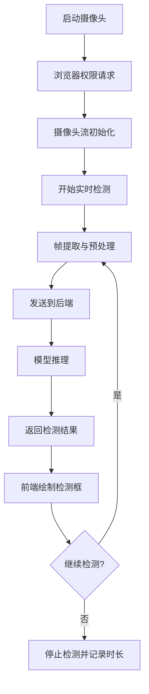
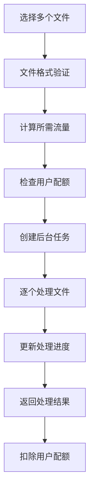

# 电力资产缺陷识别系统

基于InsPLAD数据集和YOLO11的电力设备智能识别与缺陷检测系统，支持17种电力资产类别识别和智能缺陷状态检测，为电力设备运维提供AI赋能解决方案。

## 📖 项目简介

本项目是一个完整的电力资产缺陷识别系统，集成了设备检测、缺陷分类、实时监测等功能，旨在提升电力设备运维效率和安全性。系统采用最新的YOLO11模型架构，结合InsPLAD专业数据集，实现了高精度的电力设备识别和缺陷检测。

### 🎯 核心价值

- **提升运维效率**：自动化识别替代人工巡检，提高检测速度和覆盖率
- **增强安全保障**：实时缺陷检测，及时发现安全隐患
- **降低运营成本**：减少人力投入，优化资源配置
- **数据驱动决策**：提供详细的检测数据和分析报告

## 🚀 主要功能

### 1. 智能图片识别
- **批量上传处理**：支持多种图片格式（JPG、PNG、BMP、WEBP）
- **实时识别标注**：上传即检测，实时显示边界框和标签
- **多目标检测**：单张图片可同时识别多个电力设备
- **高精度识别**：基于YOLO11m模型，在测试环境中表现良好
- **结果可视化**：在原图上绘制检测框和标签信息

### 2. 实时视频监测
- **摄像头实时检测**：支持浏览器内置摄像头，实时画面分析
- **动态频率调节**：0.1-10帧/秒可调，用户可根据设备性能调整
- **智能并发控制**：避免同时发送过多请求，保证系统稳定性
- **性能优化模式**：提供跳帧、降采样等优化策略
- **检测结果叠加**：在视频画面上实时显示检测框

### 3. 批量处理功能
- **多文件上传**：支持同时上传多个图片和视频文件
- **进度实时跟踪**：显示处理进度和当前文件状态
- **任务管理**：支持取消正在进行的批量任务
- **流量计费**：基于文件大小进行用量统计
- **结果导出**：批量下载处理结果

### 4. 用户权限管理
- **双角色系统**：管理员和普通用户角色
- **功能权限控制**：图片识别、批量处理、实时检测权限管理
- **使用量统计**：记录用户使用次数和时长
- **账户状态管理**：支持账户禁用、权限调整

### 5. 数据管理与统计
- **操作日志记录**：完整记录用户操作历史
- **使用统计报告**：管理员可查看系统使用情况
- **权限变更日志**：记录管理员操作历史
- **用户信息管理**：基本的用户信息查看和编辑

## � 技术架构

### 人工智能模型

#### 设备检测模型 - YOLO11m
- **模型类型**：YOLOv11-medium 目标检测模型
- **训练数据集**：基于电力设备数据集训练
- **检测类别**：17种电力资产设备类型
- **模型文件**：约50MB
- **部署方式**：CPU推理，支持GPU加速

#### 缺陷分类模型 - YOLO11m-cls
- **模型类型**：YOLOv11-medium 分类模型
- **分类任务**：二元分类（正常/缺陷）
- **处理流程**：先检测设备，再对检测区域进行缺陷分类

### 前端技术栈

```
Vue 3.4+              # 渐进式JavaScript框架
TypeScript 5.0+       # JavaScript超集，提供类型安全
Element Plus 2.4+     # Vue 3组件库
Vite 4.0+            # 现代化构建工具
Axios 1.6+           # HTTP客户端
Vue Router 4.0+      # 官方路由管理器
Pinia 2.1+           # 状态管理
```

### 后端技术栈

```
Python 3.8+          # 编程语言
Flask 2.3+           # 轻量级Web框架
ultralytics 8.0+     # YOLO模型推理框架
OpenCV 4.8+          # 计算机视觉库
Pillow 10.0+         # 图像处理库
PyMySQL              # MySQL数据库连接
Flask-CORS           # 跨域请求处理
```

### 部署与运维

```
HTTPS支持           # 前后端HTTPS加密通信
Vite开发服务器      # 前端开发环境
Flask开发服务器     # 后端开发环境
自签名SSL证书       # 开发环境HTTPS支持
```

## 📊 数据集说明

### 电力设备数据集
本系统使用电力设备相关数据集进行训练，包含：

- **覆盖设备**：17种常见电力线路设备类型
- **图像质量**：适合目标检测任务的标注数据
- **应用场景**：电力设备巡检和状态监测
- **数据格式**：YOLO格式标注，支持边界框检测

### 支持的设备类别

系统能够识别以下17种电力设备类型：

| 编号 | 英文名称 | 中文名称 |
|------|----------|----------|
| 1 | Damper-Spiral | 螺旋阻尼器 |
| 2 | Damper-Stockbridge | 斯托克布里奇阻尼器 |
| 3 | Glass Insulator | 玻璃绝缘子 |
| 4 | Glass Insulator Big Shackle | 大卸扣玻璃绝缘子 |
| 5 | Glass Insulator Small Shackle | 小卸扣玻璃绝缘子 |
| 6 | Glass Insulator Tower Shackle | 塔用卸扣玻璃绝缘子 |
| 7 | Lightning Rod Shackle | 避雷针卸扣 |
| 8 | Lightning Rod Suspension | 避雷针悬挂 |
| 9 | Tower ID Plate | 塔身标识牌 |
| 10 | Polymer Insulator | 聚合物绝缘子 |
| 11 | Polymer Insulator Lower Shackle | 聚合物绝缘子下卸扣 |
| 12 | Polymer Insulator Upper Shackle | 聚合物绝缘子上卸扣 |
| 13 | Polymer Insulator Tower Shackle | 聚合物绝缘子塔用卸扣 |
| 14 | Spacer | 间隔棒 |
| 15 | Vari-grip | 防振锤 |
| 16 | Yoke | 横担 |
| 17 | Yoke Suspension | 横担悬挂 |

## �️ 系统流程

### 1. 图片识别流程



### 2. 实时检测流程



### 3. 批量处理流程



## 🎨 界面展示

### 主要功能界面

1. **图片识别界面**
   - 文件上传区域（支持拖拽）
   - 检测结果实时显示
   - 检测框和标签可视化
   - 置信度信息显示

2. **实时检测界面**
   - 摄像头设备选择
   - 检测频率手动调节
   - 性能模式开关
   - 实时检测框叠加显示
   - 检测统计信息

3. **批量处理界面**
   - 多文件选择上传
   - 实时进度条显示
   - 任务管理（暂停/取消）
   - 处理结果下载

4. **管理后台界面**
   - 用户列表管理
   - 权限设置界面
   - 操作日志查看
   - 系统使用统计

5. **用户中心界面**
   - 个人信息显示
   - 使用量统计
   - 操作历史记录

## 🚀 快速开始

### 环境要求

```bash
# 系统要求
OS: Windows 10/11, Linux, macOS
RAM: 4GB+ (推荐8GB+)
网络: 支持HTTPS的现代浏览器

# 软件依赖
Python: 3.8-3.11
Node.js: 16.0+
Git: 2.0+
MySQL: 5.7+ (用于数据存储)
```

### 安装部署

1. **克隆项目**
```bash
git clone https://github.com/wskk267/ElectricAssetDefectRecognition.git
cd ElectricAssetDefectRecognition
```

2. **后端环境配置**
```bash
cd Backend
python -m venv venv
# Windows
venv\Scripts\activate
# Linux/macOS
source venv/bin/activate

pip install -r requirements.txt
```

3. **前端环境配置**
```bash
cd Web
npm install
# 或使用 yarn
yarn install
```

4. **配置数据库**
```bash
# 配置MySQL数据库连接
# 在Backend/app.py中修改数据库配置
POOL = dbutils.PooledDB(
    creator=pymysql,
    host='localhost',
    port=3306,
    user='your_username',
    password='your_password',
    database='ead'
)
```

5. **启动服务**
```bash
# 启动后端 (端口: 8090)
cd Backend
python app.py

# 启动前端 (端口: 5173)
cd Web
npm run dev
```

6. **访问系统**
- 前端界面：https://localhost:5173 (开发环境使用HTTPS)
- 后端API：https://localhost:8090
- 默认测试账户：guest/guest (普通用户)

## 📡 API 接口

### 认证接口

```http
POST /api/login
Content-Type: application/json

{
  "username": "admin",
  "password": "admin123"
}
```

### 图片识别接口

```http
POST /api/predict
Content-Type: multipart/form-data
Authorization: Bearer <token>

file: [图片文件]
```

### 批量处理接口

```http
POST /api/batch
Content-Type: multipart/form-data
Authorization: Bearer <token>

files: [多个图片/视频文件]
```

### 实时检测接口

```http
POST /api/realtime/detect
Content-Type: multipart/form-data
Authorization: Bearer <token>

file: [视频帧]
```

### 响应格式

```json
{
  "success": true,
  "data": {
    "detected_objects": 3,
    "predictions": [
      {
        "id": 1,
        "asset_category": "玻璃绝缘子",
        "defect_status": "正常",
        "confidence": 0.853,
        "center": {"x": 0.456, "y": 0.332},
        "width": 0.124,
        "height": 0.187
      }
    ],
    "inference_time_ms": 250.5
  },
  "remaining_limit": 9
}
```

## 📁 项目结构

```
ElectricAssetDefectRecognition/
├── Backend/                    # 后端服务
│   ├── app.py                 # Flask主应用
│   ├── workerImage.py         # 图像处理模块
│   ├── best.pt                # 设备检测模型
│   ├── last.pt                # 缺陷分类模型
│   ├── generate_cert.py       # SSL证书生成脚本
│   ├── cert.pem               # SSL证书文件
│   ├── key.pem                # SSL私钥文件
│   └── uploads/               # 临时上传目录
├── Web/                       # 前端应用
│   ├── src/
│   │   ├── user/             # 用户功能模块
│   │   │   ├── ImageRecognition.vue    # 图片识别
│   │   │   ├── RealtimeDetection.vue   # 实时检测
│   │   │   ├── BatchProcessing.vue     # 批量处理
│   │   │   └── UserProfile.vue         # 用户中心
│   │   ├── admin/            # 管理功能模块
│   │   │   ├── UserManagement.vue      # 用户管理
│   │   │   ├── DataAnalysis.vue        # 数据分析
│   │   │   └── LogViewer.vue           # 日志查看
│   │   ├── components/       # 公共组件
│   │   │   ├── login.vue             # 登录组件
│   │   │   ├── EnhancedTable.vue     # 表格组件
│   │   │   └── UserFormDialog.vue    # 用户表单
│   │   ├── router/          # 路由配置
│   │   ├── axios.js         # HTTP请求配置
│   │   └── composables/     # 组合式API
│   ├── public/              # 静态资源
│   ├── package.json         # 前端依赖
│   └── vite.config.js       # 构建配置
├── README.md               # 项目说明
```

## 🧪 功能测试

### 基础功能测试

```bash
# 测试图片识别功能
1. 访问图片识别页面
2. 上传测试图片
3. 查看检测结果

# 测试实时检测功能  
1. 访问实时检测页面
2. 允许摄像头权限
3. 开启实时检测
4. 观察检测效果

# 测试批量处理功能
1. 访问批量处理页面
2. 选择多个文件上传
3. 查看处理进度
4. 下载处理结果
```

## 📈 性能指标

### 模型性能

| 指标 | YOLO11m检测 | 备注 |
|------|-------------|------|
| 推理速度(GPU) | ~50ms | 依硬件配置而定 |
| 推理速度(CPU) | ~200ms | 依硬件配置而定 |
| 模型大小 | ~50MB | YOLO11m标准模型 |
| 支持分辨率 | 640x640 | 可调整 |

### 系统性能

| 指标 | 值 | 备注 |
|------|-----|------|
| 单图处理时间 | <1s | 包含网络传输 |
| 支持格式 | JPG/PNG/GIF等 | 常见图片格式 |
| 上传限制 | 16MB | 单文件大小 |
| 并发处理 | 基础支持 | 依服务器配置 |

## 🔒 安全考虑

### 数据安全
- 用户上传图片仅临时存储，处理完成后自动删除
- 支持HTTPS加密传输
- 敏感数据加密存储

### 访问控制
- JWT token身份验证
- 基于角色的权限控制(RBAC)
- API请求频率限制

## 🛠️ 配置说明

### 环境配置

```python
# Backend/app.py中的主要配置
class Config:
    # 模型文件路径
    DETECTION_MODEL_PATH = 'best.pt'
    
    # 文件上传配置
    MAX_CONTENT_LENGTH = 16 * 1024 * 1024  # 16MB
    ALLOWED_EXTENSIONS = {'png', 'jpg', 'jpeg', 'gif', 'bmp', 'webp'}
    
    # 数据库配置 (MySQL)
    DATABASE_CONFIG = {
        'host': 'localhost',
        'port': 3306,
        'user': 'your_username', 
        'password': 'your_password',
        'database': 'ead'
    }
    
    # SSL配置
    SSL_CERT = 'cert.pem'
    SSL_KEY = 'key.pem'
```

### 前端配置

```javascript
// Web/src/axios.js中的配置
import axios from 'axios'

const instance = axios.create({
  baseURL: '', // 使用代理，无需指定完整URL
  timeout: 30000,
  headers: {
    'Content-Type': 'application/json'
  }
})

// Web/vite.config.js中的代理配置
export default defineConfig({
  server: {
    https: true,
    proxy: {
      '/api': {
        target: 'https://localhost:8090',
        changeOrigin: true,
        secure: false
      }
    }
  }
})
```

## 🔧 故障排除

### 常见问题

**Q: 模型加载失败？**
A: 检查best.pt文件是否存在于Backend目录，确保模型文件完整

**Q: 实时检测功能不可用？**
A: 检查浏览器是否支持摄像头权限，确认HTTPS环境配置正确

**Q: 上传文件失败？**
A: 确认文件大小不超过16MB，格式为支持的图片类型

**Q: HTTPS连接问题？**
A: 使用自签名证书时，需要在浏览器中手动信任证书

### 日志查看

```bash
# 查看后端运行状态
# 后端启动时会在终端显示运行日志

# 查看前端开发服务器日志  
# 前端启动时会在终端显示编译和请求日志

# 查看浏览器控制台
# 打开浏览器开发者工具 -> Console 查看前端日志
```

## 🤝 贡献指南

### 开发流程

1. Fork项目到个人仓库
2. 创建功能分支：`git checkout -b feature/new-feature`
3. 提交更改：`git commit -am 'Add new feature'`
4. 推送分支：`git push origin feature/new-feature`
5. 创建Pull Request

### 代码规范

- Python: 遵循PEP 8规范
- TypeScript: 使用ESLint + Prettier
- Vue: 遵循Vue官方风格指南
- 提交信息: 使用Conventional Commits格式


## 🙏 致谢

- **Ultralytics团队**：提供优秀的YOLO11模型框架
- **Vue.js社区**：提供现代化的前端开发框架
- **Flask社区**：提供轻量级的Python Web框架
- **开源社区**：提供各种优秀的开源工具和库

## 📞 联系方式

- **项目地址**：[GitHub Repository](https://github.com/wskk267/ElectricAssetDefectRecognition)
- **问题反馈**：[Issues](https://github.com/wskk267/ElectricAssetDefectRecognition/issues)
- **邮箱联系**：wskk267@gmail.com
- **技术交流(QQ)**：1392380894

---

⭐ 如果这个项目对您有帮助，请给个Star支持一下！
