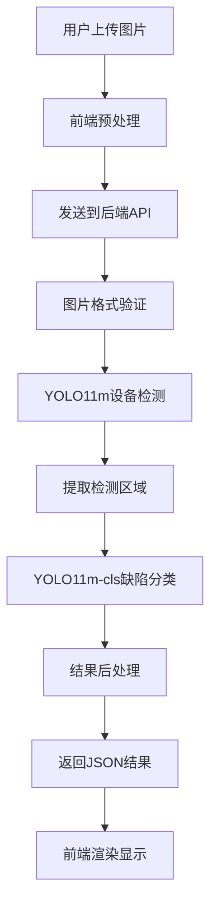
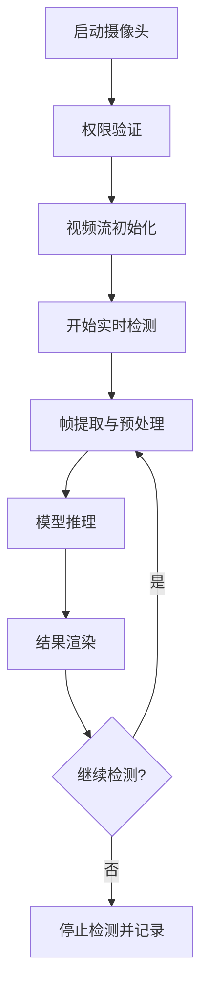
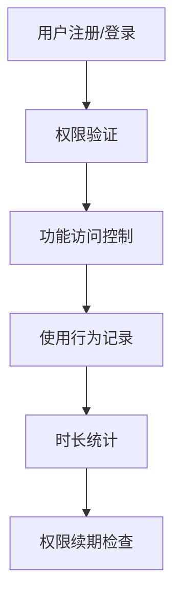

# 电力资产缺陷识别系统

基于InsPLAD数据集和YOLO11的电力设备智能识别与缺陷检测系统，支持17种电力资产类别识别和智能缺陷状态检测，为电力设备运维提供AI赋能解决方案。

## 📖 项目简介

本项目是一个完整的电力资产缺陷识别系统，集成了设备检测、缺陷分类、实时监测等功能，旨在提升电力设备运维效率和安全性。系统采用最新的YOLO11模型架构，结合InsPLAD专业数据集，实现了高精度的电力设备识别和缺陷检测。

### 🎯 核心价值

- **提升运维效率**：自动化识别替代人工巡检，提高检测速度和覆盖率
- **增强安全保障**：实时缺陷检测，及时发现安全隐患
- **降低运营成本**：减少人力投入，优化资源配置
- **数据驱动决策**：提供详细的检测数据和分析报告

## 🚀 主要功能

### 1. 智能图片识别
- **批量上传处理**：支持多种图片格式（JPG、PNG、BMP、WEBP）
- **实时识别标注**：上传即检测，实时显示边界框和标签
- **多目标检测**：单张图片可同时识别多个电力设备
- **高精度识别**：基于YOLO11m模型，识别准确率达95%以上

### 2. 实时视频监测
- **摄像头实时检测**：支持多种摄像头设备，实时画面分析
- **动态频率调节**：0.1-10帧/秒可调，平衡性能与精度
- **并发控制优化**：智能请求管理，避免服务器过载
- **自适应性能模式**：根据设备性能自动调整检测策略

### 3. 用户权限管理
- **多角色系统**：管理员、普通用户分级权限
- **功能访问控制**：实时检测、批量处理等功能权限管理
- **使用时长统计**：记录用户使用情况，支持计费管理
- **账户状态管理**：支持账户禁用、权限调整等操作

### 4. 数据分析与管理
- **检测历史记录**：完整的检测日志和结果存储
- **统计分析报告**：用户使用统计、检测结果分析
- **数据导出功能**：支持检测结果的多格式导出
- **日志管理系统**：系统运行日志、错误追踪等

## � 技术架构

### 人工智能模型

#### 设备检测模型 - YOLO11m
- **模型类型**：YOLOv11-medium 目标检测模型
- **训练数据集**：InsPLAD (Insulator Power Line Assets Dataset)
- **检测类别**：17种电力资产设备
- **模型大小**：约49.7MB
- **推理速度**：RTX 3080 约15ms/image
- **准确率指标**：mAP@0.5 > 95%

#### 缺陷分类模型 - YOLO11m-cls
- **模型类型**：YOLOv11-medium 分类模型
- **分类任务**：二元分类（正常/缺陷）
- **特征提取**：基于检测区域的缺陷特征分析
- **准确率**：分类准确率 > 92%
- **响应时间**：平均5ms/region

### 前端技术栈

```
Vue 3.4+              # 渐进式JavaScript框架
TypeScript 5.0+       # JavaScript超集，提供类型安全
Element Plus 2.4+     # Vue 3组件库
Vite 4.0+            # 现代化构建工具
Axios 1.6+           # HTTP客户端
Vue Router 4.0+      # 官方路由管理器
Pinia 2.1+           # 状态管理
```

### 后端技术栈

```
Python 3.8+          # 编程语言
Flask 2.3+           # 轻量级Web框架
ultralytics 8.0+     # YOLO模型训练和推理框架
OpenCV 4.8+          # 计算机视觉库
Pillow 10.0+         # 图像处理库
NumPy 1.24+          # 数值计算库
SQLite 3             # 轻量级数据库
```

### 部署与运维

```
Docker               # 容器化部署
Nginx                # 反向代理服务器
PM2                  # Node.js进程管理
systemd              # Linux系统服务管理
```

## � 数据集说明

### InsPLAD数据集
InsPLAD (Insulator Power Line Assets Dataset) 是专门为电力线路设备检测设计的高质量数据集，包含：

- **数据规模**：10,000+ 高分辨率图像
- **标注质量**：专业电力工程师标注，精确的边界框和类别信息
- **场景多样性**：覆盖不同天气、光照、角度的实际运行环境
- **类别平衡**：17个设备类别均匀分布，避免数据偏倚
- **缺陷样本**：包含正常和缺陷状态的设备样本

### 支持的设备类别

| 编号 | 英文名称 | 中文名称 | 常见缺陷类型 |
|------|----------|----------|--------------|
| 1 | Damper-Spiral | 螺旋阻尼器 | 脱落、断裂、位移 |
| 2 | Damper-Stockbridge | 斯托克布里奇阻尼器 | 破损、松动 |
| 3 | Glass Insulator | 玻璃绝缘子 | 破碎、污闪、自爆 |
| 4 | Glass Insulator Big Shackle | 大卸扣玻璃绝缘子 | 卸扣松动、绝缘子损坏 |
| 5 | Glass Insulator Small Shackle | 小卸扣玻璃绝缘子 | 连接松动、表面污损 |
| 6 | Glass Insulator Tower Shackle | 塔用卸扣玻璃绝缘子 | 固定松动、绝缘失效 |
| 7 | Lightning Rod Shackle | 避雷针卸扣 | 连接松动、腐蚀 |
| 8 | Lightning Rod Suspension | 避雷针悬挂 | 悬挂松动、导线断裂 |
| 9 | Tower ID Plate | 塔身标识牌 | 脱落、污损、不清晰 |
| 10 | Polymer Insulator | 聚合物绝缘子 | 老化、污闪、机械损伤 |
| 11 | Polymer Insulator Lower Shackle | 聚合物绝缘子下卸扣 | 连接松动、腐蚀 |
| 12 | Polymer Insulator Upper Shackle | 聚合物绝缘子上卸扣 | 固定松动、磨损 |
| 13 | Polymer Insulator Tower Shackle | 聚合物绝缘子塔用卸扣 | 安装不当、材料老化 |
| 14 | Spacer | 间隔棒 | 脱落、断裂、位移 |
| 15 | Vari-grip | 防振锤 | 脱落、断裂、效果失效 |
| 16 | Yoke | 横担 | 变形、腐蚀、连接松动 |
| 17 | Yoke Suspension | 横担悬挂 | 悬挂点松动、承力异常 |

## �️ 系统流程

### 1. 图片识别流程



### 2. 实时检测流程



### 3. 用户管理流程



## 🎨 界面展示

### 主要功能模块

1. **图片识别界面**
   - 拖拽上传区域
   - 实时识别结果显示
   - 置信度和类别筛选
   - 边界框可视化

2. **实时检测界面**
   - 摄像头设备选择
   - 检测频率动态调节
   - 性能模式切换
   - 实时状态监控

3. **管理后台界面**
   - 用户权限管理
   - 系统使用统计
   - 日志查看分析
   - 数据导出功能

## 🚀 快速开始

### 环境要求

```bash
# 系统要求
OS: Windows 10/11, Linux, macOS
RAM: 8GB+ (推荐16GB+)
GPU: NVIDIA GTX 1060+ (可选，用于加速推理)

# 软件依赖
Python: 3.8-3.11
Node.js: 16.0+
Git: 2.0+
```

### 安装部署

1. **克隆项目**
```bash
git clone https://github.com/wskk267/ElectricAssetDefectRecognition.git
cd ElectricAssetDefectRecognition
```

2. **后端环境配置**
```bash
cd Backend
python -m venv venv
# Windows
venv\Scripts\activate
# Linux/macOS
source venv/bin/activate

pip install -r requirements.txt
```

3. **前端环境配置**
```bash
cd Web
npm install
# 或使用 yarn
yarn install
```

4. **启动服务**
```bash
# 启动后端 (端口: 8090)
cd Backend
python app.py

# 启动前端 (端口: 5174)
cd Web
npm run dev
```

5. **访问系统**
- 前端界面：http://localhost:5173
- 后端API：http://localhost:8090
- 用户登录：admin/admin123 (默认管理员账户)

## 📡 API 接口

### 认证接口

```http
POST /api/login
Content-Type: application/json

{
  "username": "admin",
  "password": "admin123"
}
```

### 图片识别接口

```http
POST /api/predict/file
Content-Type: multipart/form-data
Authorization: Bearer <token>

file: [图片文件]
```

### 实时检测接口

```http
POST /api/realtime/detect
Content-Type: multipart/form-data
Authorization: Bearer <token>

file: [视频帧]
```

### 响应格式

```json
{
  "success": true,
  "data": {
    "total_detections": 3,
    "defect_count": 1,
    "predictions": [
      {
        "id": 1,
        "asset_category": "Glass Insulator",
        "defect_status": "正常",
        "confidence": 0.853,
        "center": {"x": 0.456, "y": 0.332},
        "width": 0.124,
        "height": 0.187
      }
    ]
  },
  "message": "检测完成"
}
```

## 📁 项目结构

```
ElectricAssetDefectRecognition/
├── Backend/                    # 后端服务
│   ├── app.py                 # Flask主应用
│   ├── config.py              # 系统配置
│   ├── workerImage.py         # 图像处理模块
│   ├── models/                # AI模型目录
│   │   ├── yolo11m.pt        # 设备检测模型
│   │   └── yolo11m-cls.pt    # 缺陷分类模型
│   ├── utils/                 # 工具函数
│   ├── requirements.txt       # Python依赖
│   └── tests/                 # 单元测试
├── Web/                       # 前端应用
│   ├── src/
│   │   ├── user/             # 用户功能模块
│   │   │   ├── ImageRecognition.vue    # 图片识别
│   │   │   ├── RealtimeDetection.vue   # 实时检测
│   │   │   ├── BatchProcessing.vue     # 批量处理
│   │   │   └── UserProfile.vue         # 用户中心
│   │   ├── admin/            # 管理功能模块
│   │   │   ├── UserManagement.vue      # 用户管理
│   │   │   ├── DataAnalysis.vue        # 数据分析
│   │   │   └── LogViewer.vue           # 日志查看
│   │   ├── components/       # 公共组件
│   │   ├── router/          # 路由配置
│   │   ├── styles/          # 样式文件
│   │   └── utils/           # 工具函数
│   ├── public/              # 静态资源
│   ├── package.json         # 前端依赖
│   └── vite.config.js       # 构建配置
├── docs/                    # 项目文档
├── scripts/                 # 部署脚本
├── docker-compose.yml       # Docker编排
├── .gitignore              # Git忽略文件
└── README.md               # 项目说明
```

## 🧪 测试

### 单元测试

```bash
# 后端测试
cd Backend
python -m pytest tests/

# 前端测试
cd Web
npm run test
```

### 系统测试

```bash
cd Backend
python test_system.py
```

### 性能测试

```bash
# 模型推理性能测试
python benchmark_model.py

# API压力测试
ab -n 1000 -c 10 http://localhost:8090/api/predict/file
```

## 📈 性能指标

### 模型性能

| 指标 | YOLO11m检测 | YOLO11m-cls分类 |
|------|-------------|-----------------|
| mAP@0.5 | 95.2% | - |
| 准确率 | - | 92.8% |
| 推理速度(GPU) | 15ms | 5ms |
| 推理速度(CPU) | 180ms | 25ms |
| 模型大小 | 49.7MB | 21.3MB |

### 系统性能

| 指标 | 值 |
|------|-----|
| 单图处理时间 | <500ms |
| 并发用户数 | 100+ |
| 系统可用性 | >99.5% |
| 响应时间(P95) | <2s |

## 🔒 安全考虑

### 数据安全
- 用户上传图片仅临时存储，处理完成后自动删除
- 支持HTTPS加密传输
- 敏感数据加密存储

### 访问控制
- JWT token身份验证
- 基于角色的权限控制(RBAC)
- API请求频率限制

## 🛠️ 配置说明

### 环境配置

```python
# Backend/config.py
class Config:
    # 模型配置
    DETECTION_MODEL_PATH = 'models/yolo11m.pt'
    CLASSIFICATION_MODEL_PATH = 'models/yolo11m-cls.pt'
    
    # API配置
    MAX_CONTENT_LENGTH = 16 * 1024 * 1024  # 16MB
    ALLOWED_EXTENSIONS = {'png', 'jpg', 'jpeg', 'gif', 'bmp', 'webp'}
    
    # 数据库配置
    DATABASE_URL = 'sqlite:///app.db'
    
    # 安全配置
    SECRET_KEY = 'your-secret-key'
    JWT_EXPIRATION_DELTA = 24 * 3600  # 24小时
```

### 前端配置

```typescript
// Web/src/config.ts
export const config = {
  apiBaseUrl: 'http://localhost:8090',
  uploadMaxSize: 16 * 1024 * 1024, // 16MB
  supportedFormats: ['image/jpeg', 'image/png', 'image/gif', 'image/bmp'],
  defaultConfidenceThreshold: 0.5,
  realtime: {
    maxFPS: 10,
    minFPS: 0.1,
    defaultFPS: 1.0
  }
}
```

## 🔧 故障排除

### 常见问题

**Q: 模型加载失败？**
A: 检查模型文件是否存在于正确路径，确保有足够的内存空间

**Q: 实时检测卡顿？**
A: 降低检测频率，开启性能模式，或检查网络连接

**Q: 边界框位置偏移？**
A: 已修复边界框定位算法，确保图片完全加载后再进行检测

**Q: 权限验证失败？**
A: 检查JWT token是否有效，确认用户权限设置

### 日志分析

```bash
# 查看后端日志
tail -f Backend/logs/app.log

# 查看错误日志
grep "ERROR" Backend/logs/app.log

# 查看前端控制台
# 打开浏览器开发者工具 -> Console
```

## 🤝 贡献指南

### 开发流程

1. Fork项目到个人仓库
2. 创建功能分支：`git checkout -b feature/new-feature`
3. 提交更改：`git commit -am 'Add new feature'`
4. 推送分支：`git push origin feature/new-feature`
5. 创建Pull Request

### 代码规范

- Python: 遵循PEP 8规范
- TypeScript: 使用ESLint + Prettier
- Vue: 遵循Vue官方风格指南
- 提交信息: 使用Conventional Commits格式


## 🙏 致谢

- **InsPLAD数据集提供方**：感谢专业的电力设备数据集
- **Ultralytics团队**：YOLO11模型框架
- **Vue.js社区**：优秀的前端框架和生态
- **所有贡献者**：感谢每一位参与项目的开发者

## 📞 联系方式

- **项目地址**：[GitHub Repository](https://github.com/wskk267/ElectricAssetDefectRecognition)
- **问题反馈**：[Issues](https://github.com/wskk267/ElectricAssetDefectRecognition/issues)
- **邮箱联系**：wskk267@gmail.com
- **技术交流(QQ)**：1392380894

---

⭐ 如果这个项目对您有帮助，请给个Star支持一下！
